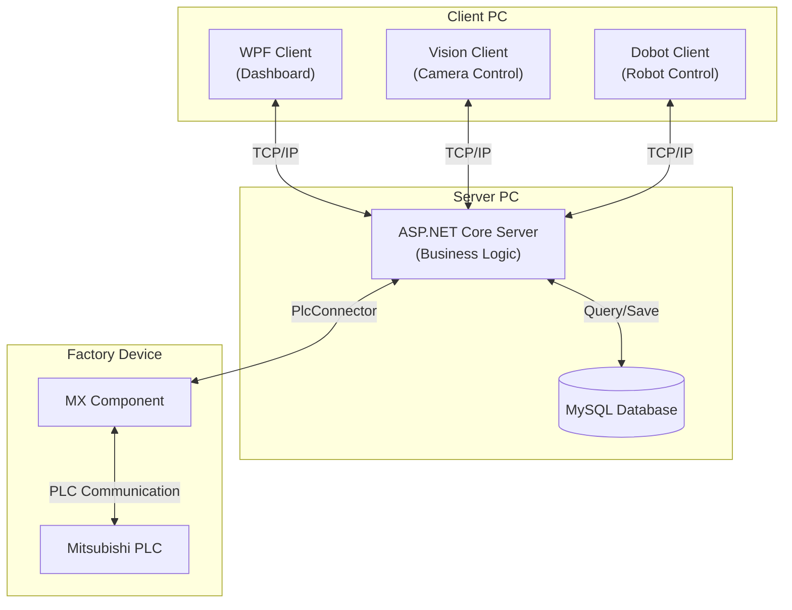

# automotive-mes-server

C# ASP.NET Core와 Mitsubishi PLC를 활용한 자동차 제조 전공정(Front-End Process) MES 구축 프로젝트입니다.

---

## 목차

- [automotive-mes-server](#automotive-mes-server)
  - [목차](#목차)
  - [1. 프로젝트 소개](#1-프로젝트-소개)
  - [2. 주요 기능](#2-주요-기능)
    - [설비 제어 및 공정 자동화](#설비-제어-및-공정-자동화)
    - [생산 관리 및 품질 분석](#생산-관리-및-품질-분석)
    - [시스템 모니터링](#시스템-모니터링)
  - [3. 시스템 아키텍처](#3-시스템-아키텍처)
    - [주요 구성 요소](#주요-구성-요소)
  - [4. 기술 스택](#4-기술-스택)
    - [주요 NuGet 패키지](#주요-nuget-패키지)
  - [5. 시작하기](#5-시작하기)
    - [사전 요구사항](#사전-요구사항)
    - [설치 및 실행](#설치-및-실행)
  - [6. 데이터베이스](#6-데이터베이스)
    - [1. 주문 (Orders)](#1-주문-orders)
    - [2. 생산 (Production)](#2-생산-production)
  - [7. 프로젝트 팀 구성 및 역할](#7-프로젝트-팀-구성-및-역할)
    - [나의 프로젝트 기여도](#나의-프로젝트-기여도)

## 1. 프로젝트 소개

본 프로젝트는 자동차 차체(Body) 조립을 위한 **스마트 팩토리 전공정(Front-End Process) 관리 MES 시스템**입니다.

**ASP.NET 기반의 서버를**를 주축으로, 설비(PLC), 로봇(Dobot), 비전, 그리고 관리자(WPF Client)를 유기적으로 연결하였습니다.
단순히 설비를 제어하는 것을 넘어, 생산 주문(Order) 생성부터 로봇 조립, 비전 검사를 통한 품질 판정까지
**제조 공정의 전체 라이프사이클을 자동화하고 데이터를 시각화**하는 데 중점을 두었습니다.

이 시스템은 장비 간의 통신 프로토콜을 통합하여,
**제어(OT) 영역과 정보(IT) 영역이 실시간으로 데이터를 주고받는 스마트 제조 환경**을 구현하였습니다.

## 2. 주요 기능

### 설비 제어 및 공정 자동화
*   **실시간 PLC 제어**: MX Component를 통해 설비(PLC)의 구동 상태를 모니터링하고 제어 명령을 수행합니다.
*   **로봇 협동 조립**: Dobot 로봇 제어 클라이언트와 통신을 통해 자동차 조립 공정을 수행하며, 로봇의 상태를 모니터링합니다.

### 생산 관리 및 품질 분석
*   **생산 오더 관리 (MOM)**: MySQL 데이터베이스를 기반으로 작업 지시를 생성하고, 공정 단계별 진행 상황을 추적 관리합니다.
*   **비전 기반 품질 관리 (QA)**: 비전 카메라가 판독한 양품/불량 데이터를 수신하여 DB에 적재하고, 불량 발생 시 즉각적인 알람 및 리젝트(Reject) 로직을 수행합니다.

### 시스템 모니터링
*   **통합 대시보드**: WPF 클라이언트를 통해 전체 공정의 흐름과 생산 실적(불량률, 가동률 등)을 시각적으로 모니터링할 수 있습니다.
*   **시스템 로그 추적**: Serilog를 도입하여 서버 및 장비 간의 통신 로그와 예외 상황을 기록, 시스템 안정성을 확보했습니다.

## 3. 시스템 아키텍처

본 프로젝트는 2대의 PC를 기반으로 구성됩니다. 메인 서버 PC에서는 MES 서버가 동작하며,
클라이언트 PC에서는 비전 카메라, Dobot 로봇 제어 프로그램 및 WPF 클라이언트가 실행됩니다.
두 PC는 동일한 공유기 네트워크에 연결되어 TCP/IP 프로토콜로 통신합니다.



### 주요 구성 요소

1.  **PLC 제어 (`PlcConnector`)**
    *   **MX Component**를 미들웨어로 사용하여 Mitsubishi PLC와 통신합니다.
    *   설비 데이터를 주기적으로 Polling(읽기)하거나 제어 명령(쓰기)을 수행합니다.

2.  **외부 클라이언트 통신 (TCP/IP)**
    *   **Vision Client**: 검사 명령을 수신하고, 카메라로 판독한 제품(자동차 바퀴)의 불량 여부를 서버로 전송합니다.
    *   **Dobot Client**: 서버로부터 조립 명령을 받아 로봇을 제어하고, 동작 상태를 실시간으로 보고합니다.
    *   **WPF Client**: 작업자를 위한 HMI 대시보드로, 생산 현황 모니터링 및 공정 관리 기능을 제공합니다.

3.  **데이터 관리 및 로깅**
    *   **OrderService**: 수집된 데이터를 비즈니스 로직에 맞춰 가공합니다.
    *   **MySQL**: 생산 이력, 불량, 주문 정보 등 모든 데이터를 저장하고 관리합니다.
    *   **Serilog**: 서버의 운영 상태 및 예외 상황을 체계적으로 로깅하여 유지보수 효율을 높입니다.

## 4. 기술 스택

- **Backend**: C# (ASP.NET Core 8.0)
- **Database**: MySQL
- **PLC Communication**: Mitsubishi MX Component
- **IDE**: Visual Studio

### 주요 NuGet 패키지
| 패키지명 | 버전 | 설명 |
|---|---|---|
| `Serilog.AspNetCore` | 9.0.0 | 애플리케이션 로깅을 위한 라이브러리 |
| `Serilog.Sinks.File` | 7.0.0 | 로그를 파일에 저장하기 위한 Serilog 싱크 |
| `Serilog.Sinks.Console`| 6.1.1 | 로그를 콘솔에 출력하기 위한 Serilog 싱크 |
| `Serilog.Sinks.Async` | 2.1.0 | 로그를 비동기 방식으로 처리하기 위한 Serilog 싱크 |
| `System.Data.Odbc` | 8.0.0 | ODBC 데이터 소스 연결을 위한 라이브러리 |

## 5. 시작하기

### 사전 요구사항

- .NET 8.0 SDK
- Visual Studio
- MySQL
- Mitsubishi MX Component

### 설치 및 실행

1.  리포지토리를 클론합니다.
    ```shell
    git clone https://github.com/your-username/automotive-mes-server.git
    ```
2.  Visual Studio에서 `MES.Server.sln` 파일을 엽니다.
3.  `appsettings.json` 파일에 자신의 DB 연결 문자열 및 기타 설정을 입력합니다.
    ```json
    {
      "ConnectionStrings": {
        "DefaultConnection": "Server=localhost;Database=mes_db;Uid=root;Pwd=your_password;"
      }
    }
    ```
4.  솔루션을 빌드하고, `F5` 키를 눌러 프로젝트를 실행합니다.

## 6. 데이터베이스

데이터베이스의 모든 테이블 컬럼은 `NOT NULL` 제약조건을 가집니다.

### 1. 주문 (Orders)
고객의 주문 정보를 관리합니다.

| 컬럼명 | 데이터 타입 | 제약조건 | 설명 |
|---|---|---|---|
| `주문ID` | `INT` | `Primary Key` | 주문 고유 식별자 |
| `주문수량` | `INT` | | 주문된 제품의 총 수량 |

### 2. 생산 (Production)
실제 생산 공정의 정보를 관리합니다.

| 컬럼명 | 데이터 타입 | 제약조건 | 설명 |
|---|---|---|---|
| `생산코드` | `INT` | `Primary Key` | 생산 작업 고유 식별자 |
| `생산수량` | `INT` | | 현재까지 생산된 제품의 수량 |

## 7. 프로젝트 팀 구성 및 역할

총 5명의 팀원이 각자의 강점을 살려 하드웨어 설계부터 소프트웨어 개발까지 역할을 분담했습니다.

| 이름 | 포지션 | 담당 업무 |
| :--- | :--- | :--- |
| **최윤호** | **MES Server & PLC & HMI & SCADA** | **ASP.NET 서버 구축, PLC 제어, 시스템 통합 (본인)** |
| 강선혁 | Team Leader | PM, SolidWorks 기구 설계, 3D 프린팅 및 설비 조립 |
| 김현아 | Client & Robot | Python(Dobot, Vision) 제어, WPF 대시보드 클라이언트 개발 |
| 신우재 | HW Support | Dobot 티칭, 하드웨어 조립 및 트러블 슈팅 |
| 최승규 | Electrical Design | EPLAN 전기 도면 설계 |

### 나의 프로젝트 기여도

저는 본 프로젝트에서 **OT(제어)와 IT(서버)를 잇는 시스템 통합**을 주도했습니다.
하단부의 PLC 제어부터 상단부의 MES 서버 구축까지 **데이터 파이프라인의 전 과정**을 담당했습니다.

*   **MES Backend Server 개발**
    *   C# ASP.NET Core 기반의 RESTful API 서버 구축
    *   전체 시스템 아키텍처 설계 및 데이터베이스(MySQL) 모델링
*   **PLC 제어 및 시스템 연동**
    *   Mitsubishi PLC 래더 로직 작성 및 공정 제어
    *   MX Component를 활용한 `PLC <--> Server` 간 미들웨어 구현
*   **HMI / SCADA 구축**
    *   M2I HMI 작화 및 현장 제어 패널 구성
    *   CIMON SCADA를 활용한 공정 모니터링 시스템 구축