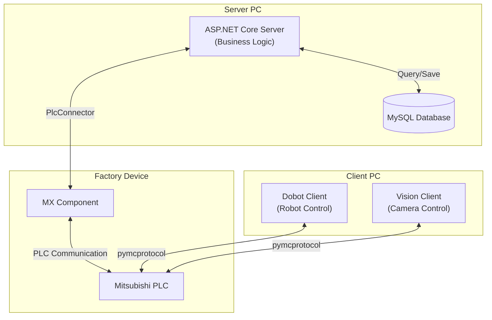

# 전기차 전공정 MES 구축 프로젝트


## 목차

- [전기차 전공정 MES 구축 프로젝트](#전기차-전공정-mes-구축-프로젝트)
  - [목차](#목차)
  - [1. 프로젝트 소개](#1-프로젝트-소개)
  - [2. 주요 기능](#2-주요-기능)
  - [3. 시스템 아키텍처](#3-시스템-아키텍처)
  - [4. 기술 스택](#4-기술-스택)
  - [5. 시작하기](#5-시작하기)
  - [6. 데이터베이스](#6-데이터베이스)
  - [7. PLC 입출력 맵](#7-plc-입출력-맵)
  - [8. 프로젝트 팀 구성 및 역할](#8-프로젝트-팀-구성-및-역할)
    - [나의 프로젝트 기여도](#나의-프로젝트-기여도)
    - [개발 회고록 (Dev Log)](#개발-회고록-dev-log)


## 1. 프로젝트 소개

> **"스스로 판단하고 움직이는, 살아있는 전기차 공장을 구현하다."**

본 프로젝트는 제어(OT)와 정보(IT)가 실시간으로 소통하는 **전기차 전공정(Front-End) 스마트 팩토리**입니다.

**ASP.NET 기반의 서버**를 주축으로, 설비(PLC), 비전(Vision), 로봇(Dobot)을 유기적으로 연결하였습니다.
단순히 설비를 제어하는 것을 넘어, 생산 주문(Order)부터 로봇 조립, 비전 검사를 통한 품질 판정까지
**제조 공정의 전체 라이프사이클을 자동화하고 데이터를 시각화**하는 데 중점을 두었습니다.

## 2. 주요 기능

### 설비 제어 및 공정 자동화
*   **실시간 PLC 제어**: MX Component를 통해 설비(PLC)의 구동 상태를 모니터링하고 제어 명령을 수행합니다.
*   **Dobot 로봇 연계**: Dobot 로봇을 통해 자동차 조립 공정과 도색 작업을 수행합니다.

### 생산 관리 및 품질 분석
*   **생산 오더 관리**: MySQL 데이터베이스를 기반으로 작업 지시를 생성하고, 공정 상황을 추적 관리합니다.
*   **품질 관리**: 비전 카메라가 판독한 양품/불량 데이터를 DB에 저장하고, 불량 발생 시 알람 발생 및 불량품 창고로 이송합니다.

### 시스템 모니터링
*   **통합 대시보드**: WPF 클라이언트를 통해 전체 공정의 흐름과 생산 실적을 시각적으로 모니터링할 수 있습니다.
*   **시스템 로그 추적**: Serilog를 도입하여 서버와 장비 간의 통신 로그 및 예외 상황을 기록, 시스템 안정성을 확보했습니다.

## 3. 시스템 아키텍처

본 프로젝트는 효율적인 리소스 분배를 위해 2대의 PC를 사용하는 구조로 설계했습니다.
서버 PC에서는 MES 서버와 DB를, 클라이언트 PC에서는 비전 카메라와 로봇 제어를 담당하여 부하를 분산시킵니다.



### 주요 구성 요소

1.  **PLC-연계 제어**
    *   **MES Server**: **MX Component**를 미들웨어로 사용하여 Mitsubishi PLC와 주기적으로 통신합니다.
    *   **Device Clients (Vision, Dobot)**: **pymcprotocol** 라이브러리를 통해 PLC와 직접 통신합니다.
        *   **Vision Client**: PLC로부터 검사 신호를 직접 읽어 촬영을 진행하며, 도색 판정 결과를 PLC에 전송합니다.
        *   **Dobot Client**: PLC로부터 작업 신호를 수신하여 Dobot 로봇 동작을 수행하고, 완료 신호를 전송합니다.

2.  **데이터 관리 및 로깅**
    *   **OrderService**: 수집된 데이터를 비즈니스 로직에 맞춰 가공합니다.
    *   **MySQL**: 생산 이력, 불량, 주문 정보 등 모든 데이터를 저장하고 관리합니다.
    *   **Serilog**: 서버의 운영 상태 및 예외 상황을 체계적으로 로깅하여 유지보수 효율을 높입니다.

## 4. 기술 스택

### Backend
 

### Database


### PLC Communication


### IDE
 

### 주요 NuGet 패키지
| 패키지명 | 버전 | 설명 |
|---|---|---|
| `Serilog.AspNetCore` | 9.0.0 | 애플리케이션 로깅을 위한 라이브러리 |
| `Serilog.Sinks.File` | 7.0.0 | 로그를 파일에 저장하기 위한 Serilog 싱크 |
| `Serilog.Sinks.Console`| 6.1.1 | 로그를 콘솔에 출력하기 위한 Serilog 싱크 |
| `Serilog.Sinks.Async` | 2.1.0 | 로그를 비동기 방식으로 처리하기 위한 Serilog 싱크 |
| `System.Data.Odbc` | 8.0.0 | ODBC 데이터 소스 연결을 위한 라이브러리 |

## 5. 시작하기

### 사전 요구사항

- .NET 8.0 SDK
- Visual Studio / Visual Studio Code
- MySQL
- Mitsubishi MX Component

### 설치 및 실행

1.  리포지토리를 클론합니다.
    ```shell
    git clone https://github.com/your-username/automotive-mes-server.git
    ```
2.  Visual Studio에서 `MES.Server.sln` 파일을 엽니다.
3.  `appsettings.json` 파일에 자신의 DB 연결 문자열 및 기타 설정을 입력합니다.
    ```json
    {
      "ConnectionStrings": {
        "DefaultConnection": "Server=localhost;Database=mes_db;Uid=root;Pwd=your_password;"
      }
    }
    ```
4.  솔루션을 빌드하고, `F5` 키를 눌러 프로젝트를 실행합니다.

## 6. 데이터베이스

기본적으로 모든 컬럼은 `NOT NULL` 제약조건을 가지며, 예외적으로 생산 종료 시점이 나중에 결정되는 `production` 및 `production_history` 테이블의 `end_date` 컬럼만 `NULL`을 허용합니다.

### 테이블 이원화 전략 (Dual-Table Strategy)

본 프로젝트는 데이터 무결성과 성능 최적화를 위해 **이원화된 테이블 구조**를 채택했습니다.
이러한 설계는 **CIMON SCADA 시스템의 태그(Tag) 구조적 한계**를 극복하고 성능을 최적화하기 위해 도입되었습니다. SCADA는 미리 생성된 정적 태그를 사용하므로, 데이터가 계속 누적되는 테이블을 직접 연동할 경우 성능 저하가 발생할 수 있습니다.


*   **운영 테이블 (Active DB)**: `order`, `production`
    *   현재 진행 중인 최신 데이터(최대 30건)만 유지합니다.
    *   데이터 양을 일정하게 유지하여 SCADA 시스템의 부하를 최소화합니다.
*   **기록 테이블 (History DB)**: `order_history`, `production_history`
    *   운영 테이블에서 30건을 초과한 데이터는 이곳으로 **이관(Migration)**됩니다.
    *   데이터의 영구 보존과 사후 분석을 위한 용도입니다.
*   **비전 테이블 (Vision DB)**: `vision_upper`, `vision_lower`
    *   비전 카메라가 판독한 데이터는 이곳으로 저장됩니다.
    *   양품/불량 결과와 측정 시각을 저장합니다.

이 구조를 통해 **실시간 모니터링의 효율성**과 **데이터의 영구적 보존**이라는 두 가지 목표를 동시에 달성합니다.

### `order` (주문 관리)

| 컬럼명 | 설명 | 데이터 타입 | 제약조건 |
|---|---|---|---|
| `order_id` | 주문 ID | `INT(11)` | `PRIMARY KEY` |
| `model_code` | 모델명 | `VARCHAR(50)` | |
| `order_quantity`| 주문 수량 | `INT(11)` | |
| `order_date` | 주문 날짜 | `DATETIME` | |
| `order_status` | 주문 상태 | `VARCHAR(50)` | |

### `order_history` (주문 관리) [백업]

| 컬럼명 | 설명 | 데이터 타입 | 제약조건 |
|---|---|---|---|
| `backup_id` | 백업 ID | `INT(11)` | `PRIMARY KEY` & `AUTO_INCREMENT` |
| `order_id` | 주문 ID | `INT(11)` | |
| `model_code` | 모델명 | `VARCHAR(50)` | |
| `order_quantity`| 주문 수량 | `INT(11)` | |
| `order_date` | 주문 날짜 | `DATETIME` | |
| `order_status` | 주문 상태 | `VARCHAR(50)` | |
| `backed_date` | 백업 날짜 | `DATETIME` | |

### `production` (생산 관리)

| 컬럼명 | 설명 | 데이터 타입 | 제약조건 |
|---|---|---|---|
| `production_id` | 생산 ID | `INT(11)` | `PRIMARY KEY` |
| `model_code` | 모델명 | `VARCHAR(50)` | |
| `upper_quantity`| 상부 생산 수량 | `INT(11)` | |
| `lower_quantity`| 하부 생산 수량 | `INT(11)` | |
| `good_quantity` | 양품 수량 | `INT(11)` | |
| `bad_quantity` | 불량 수량 | `INT(11)` | |
| `start_date` | 생산 시작 날짜 | `DATETIME` | |
| `end_date` | 생산 종료 날짜 | `DATETIME` | `NULL 허용` |

### `production_history` (생산 관리) [백업]

| 컬럼명 | 설명 | 데이터 타입 | 제약조건 |
|---|---|---|---|
| `backup_id` | 백업 ID | `INT(11)` | `PRIMARY KEY` & `AUTO_INCREMENT` |
| `production_id` | 생산 ID | `INT(11)` | |
| `model_code` | 모델명 | `VARCHAR(50)` | |
| `upper_quantity`| 상부 생산 수량 | `INT(11)` | |
| `lower_quantity`| 하부 생산 수량 | `INT(11)` | |
| `good_quantity` | 양품 수량 | `INT(11)` | |
| `bad_quantity` | 불량 수량 | `INT(11)` | |
| `start_date` | 생산 시작 날짜 | `DATETIME` | |
| `end_date` | 생산 종료 날짜 | `DATETIME` | `NULL 허용` |
| `backed_date` | 백업 날짜 | `DATETIME` | |

### `vision_upper` (상부 비전 카메라)

| 컬럼명 | 설명 | 데이터 타입 | 제약조건 |
|---|---|---|---|
| `vision_id` | 비전 ID | `INT(11)` | `PRIMARY KEY` & `AUTO_INCREMENT` |
| `production_id` | 생산 ID | `INT(11)` | |
| `model_code` | 모델명 | `VARCHAR(50)` | |
| `result` | 결과 | `VARCHAR(50)` | |
| `measured_at` | 측정 시각 | `DATETIME` | |

### `vision_lower` (하부 비전 카메라)

| 컬럼명 | 설명 | 데이터 타입 | 제약조건 |
|---|---|---|---|
| `vision_id` | 비전 ID | `INT(11)` | `PRIMARY KEY` & `AUTO_INCREMENT` |
| `production_id` | 생산 ID | `INT(11)` | |
| `model_code` | 모델명 | `VARCHAR(50)` | |
| `result` | 결과 | `VARCHAR(50)` | |
| `measured_at` | 측정 시각 | `DATETIME` | |

## 7. PLC 입출력 맵

### 입력 (X)

| 접점 | 설명 |
|---|---|
| X0 | 하부공급감지센서 |
| X1 | 하부비전감지센서 |
| X2 | 하부로봇감지센서 |
| X3 | 하부종단센서 |
| X4 | 상부공급감지센서 |
| X5 | 상부로봇감지센서 |
| X6 | 상부비전감지센서 |
| X7 | 상부종단센서 |
| X8 | 하부스토퍼 하강센서 |
| X10 | 상부공급실린더 전진센서 |
| X11 | 상부공급실린더 후진센서 |
| X12 | 하부배출실린더 전진센서 |
| X13 | 하부배출실린더 후진센서 |
| X14 | 하부공급실린더 전진센서 |
| X15 | 하부공급실린더 후진센서 |
| X40 | 자동모드 스위치 |
| X41 | 비상정지 B접점 |

### 출력 (Y)

| 접점 | 설명 |
|---|---|
| Y30 | 하부1차 컨베이어 출력 |
| Y31 | 하부2차 컨베이어 출력 |
| Y32 | 상부1차 컨베이어 출력 |
| Y33 | 상부2차 컨베이어 출력 |
| Y34 | 하부공급실린더 출력 |
| Y35 | 하부배출실린더 출력 |
| Y36 | 상부공급실린더 출력 |
| Y37 | 하부스토퍼 출력(B접점) |
| Y50 | PLC전원램프(하얀색) |
| Y51 | 작업동작램프(초록색) |
| Y52 | 수동동작램프(노랑색) |
| Y53 | 비상정지램프(빨간색) |

## 8. 프로젝트 팀 구성 및 역할

총 5명의 팀원이 각자의 강점을 살려 하드웨어 설계부터 소프트웨어 개발까지 역할을 분담했습니다.

| 이름 | 포지션 | 담당 업무 |
| :--- | :--- | :--- |
| **최윤호** | **OT/IT System Integration** | **MES 서버 구축, PLC 제어, HMI 작화, DB 설계, SCADA 구현** |
| 강선혁 | Team Leader | SolidWorks 기구 설계/모델링, 3D 프린팅 및 설비 조립 |
| 김현아 | Robot & Vision Control | 다관절 로봇(Dobot) 제어, 비전 카메라 제어, DB 기획 |
| 신우재 | HW Support | Dobot 로봇 티칭, 하드웨어 조립 및 트러블 슈팅 |
| 최승규 | Electrical Design | EPLAN 전기 도면 설계, 3D 모델링 보조, 아이디어 제안 |

### 나의 프로젝트 기여도

저는 본 프로젝트에서 **OT(제어)와 IT(서버)를 잇는 시스템 통합**을 주도했습니다.
하단부의 PLC 제어부터 상단부의 MES 서버 구축까지 **데이터 파이프라인의 전 과정**을 담당했습니다.

*   **MES Backend Server 개발**
    *   C# ASP.NET Core 기반의 RESTful API 서버 구축
    *   전체 시스템 아키텍처 설계 및 데이터베이스(MySQL) 모델링
*   **PLC 제어 및 시스템 연동**
    *   Mitsubishi PLC 래더 로직 작성 및 공정 제어
    *   MX Component를 활용한 `PLC <--> Server` 간 양방향 통신 미들웨어 구현
*   **HMI / SCADA 구축**
    *   M2I HMI 작화 및 현장 제어 패널 구성
    *   CIMON SCADA를 활용한 실시간 공정 모니터링 시스템 구축

### 개발 회고록 (Dev Log)

이 프로젝트를 진행하며 마주친 기술적 난관과 해결 과정을 블로그에 기록했습니다.

*   [MES 구축 프로젝트 1주차: 최종 프로젝트를 시작하며](https://velog.io/@yunho21/%EB%A1%9C%EB%B4%87%ED%99%9C%EC%9A%A921%EC%A3%BC%EC%B0%A8-MES-%EA%B5%AC%EC%B6%95-1%EC%A3%BC%EC%B0%A8-%ED%9A%8C%EA%B3%A0%EB%A1%9D)
*   [MES 구축 프로젝트 2주차: 공정 설계와 PLC 통신 테스트](https://velog.io/@yunho21/%EB%A1%9C%EB%B4%87%ED%99%9C%EC%9A%A922%EC%A3%BC%EC%B0%A8-MES-%EA%B5%AC%EC%B6%95-2%EC%A3%BC%EC%B0%A8-%ED%9A%8C%EA%B3%A0%EB%A1%9D)
*   [MES 구축 프로젝트 3주차: HMI 연동과 C# 제어의 시작](https://velog.io/@yunho21/%EB%A1%9C%EB%B4%87%ED%99%9C%EC%9A%A923%EC%A3%BC%EC%B0%A8-MES-%EA%B5%AC%EC%B6%95-3%EC%A3%BC%EC%B0%A8-%ED%9A%8C%EA%B3%A0%EB%A1%9D)
*   [MES 구축 프로젝트 4주차: MES 서버의 기초 공사](https://velog.io/@yunho21/%EB%A1%9C%EB%B4%87%ED%99%9C%EC%9A%A924%EC%A3%BC%EC%B0%A8-MES-%EA%B5%AC%EC%B6%95-4%EC%A3%BC%EC%B0%A8-%ED%9A%8C%EA%B3%A0%EB%A1%9D)
*   [MES 구축 프로젝트 5주차: DB 구축과 설비의 완성](https://velog.io/@yunho21/%EB%A1%9C%EB%B4%87%ED%99%9C%EC%9A%A925%EC%A3%BC%EC%B0%A8-MES-%EA%B5%AC%EC%B6%95-5%EC%A3%BC%EC%B0%A8-%ED%9A%8C%EA%B3%A0%EB%A1%9D)
*   [MES 구축 프로젝트 6주차: 설비 로직 작성과 코드 품질 개선](https://velog.io/@yunho21/%EB%A1%9C%EB%B4%87%ED%99%9C%EC%9A%A926%EC%A3%BC%EC%B0%A8-MES-%EA%B5%AC%EC%B6%95-6%EC%A3%BC%EC%B0%A8-%ED%9A%8C%EA%B3%A0%EB%A1%9D)
*   [MES 구축 프로젝트 7주차: SCADA 관제 구현과 트러블 슈팅](https://velog.io/@yunho21/%EB%A1%9C%EB%B4%87%ED%99%9C%EC%9A%A927%EC%A3%BC%EC%B0%A8-MES-%EA%B5%AC%EC%B6%95-7%EC%A3%BC%EC%B0%A8-%ED%9A%8C%EA%B3%A0%EB%A1%9D)
*   [MES 구축 프로젝트 8주차: 위기 속에서 배운 협업의 가치](https://velog.io/@yunho21/%EB%A1%9C%EB%B4%87%ED%99%9C%EC%9A%A928%EC%A3%BC%EC%B0%A8-MES-%EA%B5%AC%EC%B6%95-%ED%94%84%EB%A1%9C%EC%A0%9D%ED%8A%B8-8%EC%A3%BC%EC%B0%A8-%ED%9A%8C%EA%B3%A0%EB%A1%9D)
*   [MES 구축 프로젝트 9주차: 살아있는 전기차 공장 완성(Final)](https://velog.io/@yunho21/%EB%A1%9C%EB%B4%87%ED%99%9C%EC%9A%A929%EC%A3%BC%EC%B0%A8-MES-%EA%B5%AC%EC%B6%95-%ED%94%84%EB%A1%9C%EC%A0%9D%ED%8A%B8-9%EC%A3%BC%EC%B0%A8-%ED%9A%8C%EA%B3%A0%EB%A1%9D-wbiboemz)